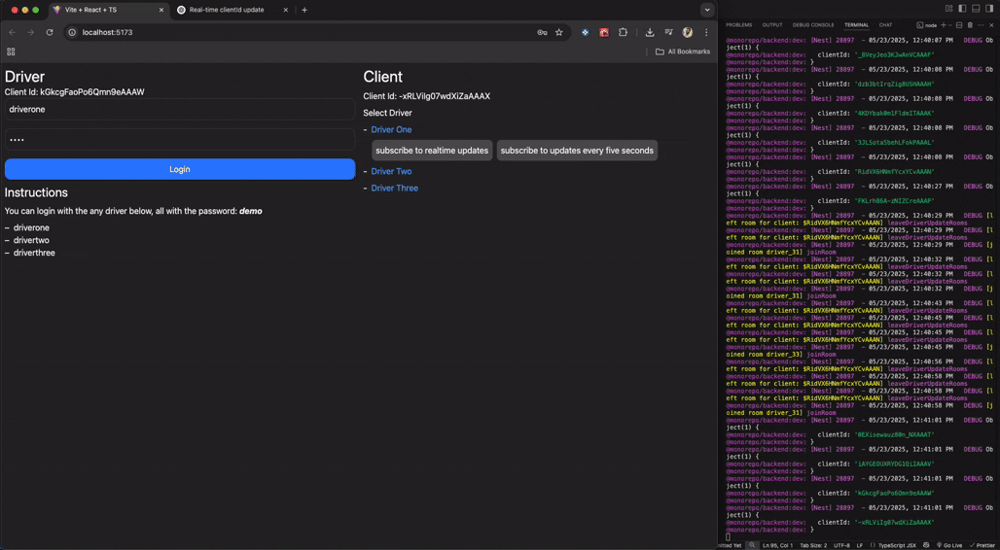
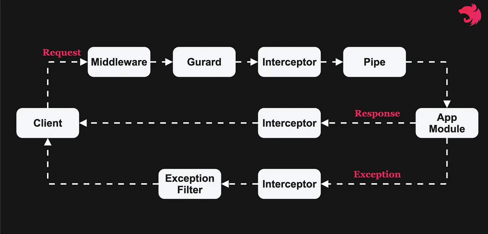

### Introduction

Hello, 👋

This is my solution to the [MightyByte Backend Challenge](https://docs.google.com/document/d/1ViVqaeGJChHFWCOdyD-HLapPi9yyGQTIUIONzBCfMxI/edit?tab=t.0#heading=h.om8r9lxbkeoc). This repository includes both the backend implementation and a user interface for testing the challenge requirements.

---



### Prerequisites

- **Node.js** v20 (recommended)
- **Yarn** package manager

This project is organized as a Turborepo monorepo, enabling simultaneous development of the frontend and backend.

---

### Folder structure

- apps:
  - backend (main codebase)
  - frontend
- packages
  - shared

### Installation

1. Clone the repository.
2. From the project root, install dependencies:

   ```bash
   yarn install
   ```

---

### Development

To start both the frontend and backend in development mode, run:

```bash
yarn dev
```

This command will:

- Launch the backend server.
- Start the frontend.
- Open the UI in your default browser at `http://localhost:5173/`.

---

### Architecture Overview

The backend is built with NestJS and adheres to its standard request lifecycle, with enhancements to support both HTTP and WebSocket communication.



#### Customizations

- **WebSocket Exception Filter**

  Intercepts thrown HTTP exceptions and emits a `WEBSOCKET_ERROR` event to connected clients. This ensures uniform error handling across HTTP and WebSocket channels.
  _Implementation_: `apps/backend/src/utils/websocket.exception-filter.ts`

- **Zod Validation Pipe**

  Applies schema-based validation to all controller actions and WebSocket event handlers, guaranteeing that incoming JSON payloads conform to expected shapes.
  _Implementation_: `apps/backend/src/utils/zod.pipe.ts`
  [Zod Documentation](https://zod.dev/)

---

### Demo Credentials

Use the following accounts to test the API and UI:

| Username      | Password |
| ------------- | -------- |
| `driverone`   | demo     |
| `drivertwo`   | demo     |
| `driverthree` | demo     |

---

### REST Endpoints

- **POST** `/login`

  Authenticate a driver and receive a JWT.

- **POST** `/refresh-token`

  Refresh the driver’s authentication token.

- **POST** `/driver/update`

  Submit the driver’s current coordinates to the database and message broker.

---

### WebSocket Events

All event names are defined in [`packages/shared/src/enums/websocket-messages.enum.ts`](packages/shared/src/enums/websocket-messages.enum.ts).

- **UPDATE_DRIVER_LOCATION**

  Emit to update the driver’s location in real time (equivalent to the `/driver/update` endpoint).

- **WEBSOCKET_ERROR**

  Emitted when an error occurs; clients should subscribe to this to receive error notifications.

- **SUBSCRIBE_TO_DRIVER_LOCATION_UPDATE**

  Subscribe to a WebSocket room that streams live location updates for a specific driver.

- **UNSUBSCRIBE_FROM_DRIVER_LOCATION_UPDATE**

  Unsubscribe to a WebSocket room that streams live location updates for a specific driver.

- **SUBSCRIBE_TO_DRIVER_LOCATION_UPDATE_EVERY_FIVE_SECONDS**

  Subscribe to periodic location updates (every 5 seconds) for a specific driver.

- **UNSUBSCRIBE_TO_DRIVER_LOCATION_UPDATE_EVERY_FIVE_SECONDS**

  Unsubscribe to periodic location updates (every 5 seconds) for a specific driver.

- **DRIVER_DETAILS_AND_LOCATION_RESPONSE**

  Sent in response to subscription events, containing the driver’s details and latest location.

- **OFFLINE_DRIVER**

  Emitted when a driver has not reported location data for over 10 minutes; clients should subscribe to receive offline notifications.
